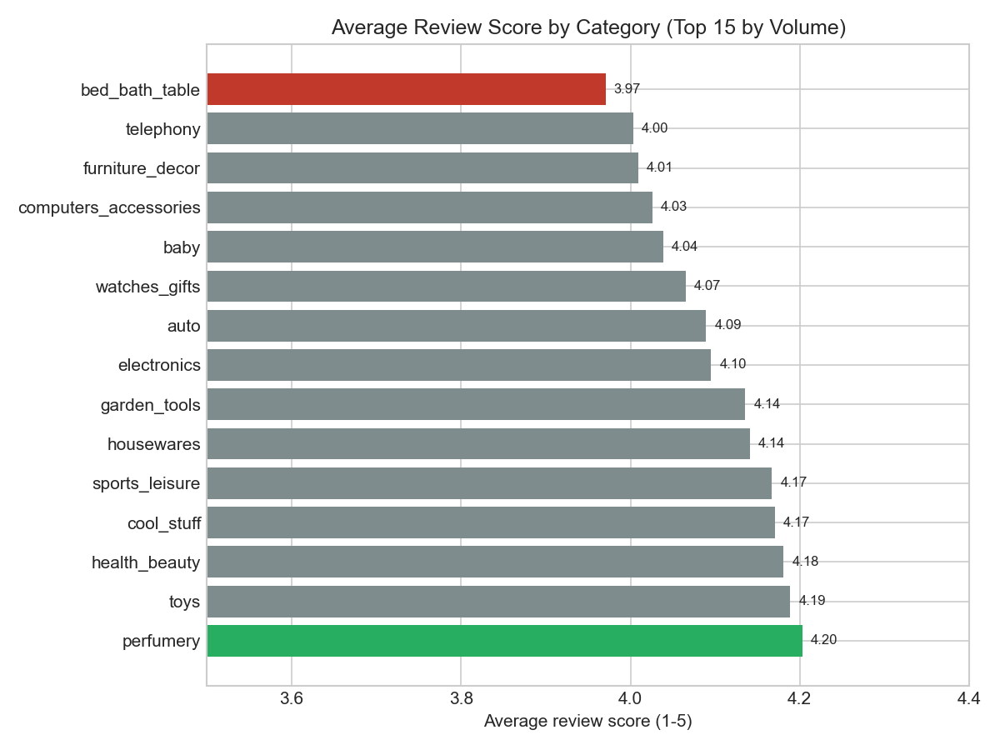
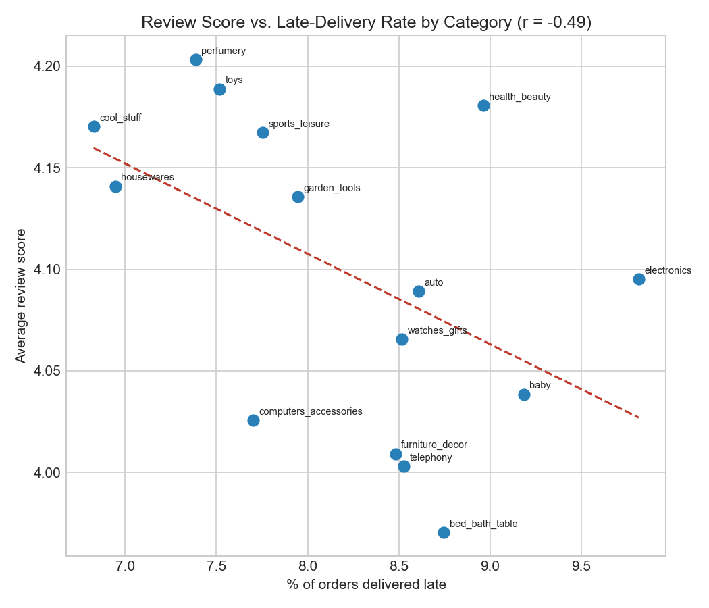
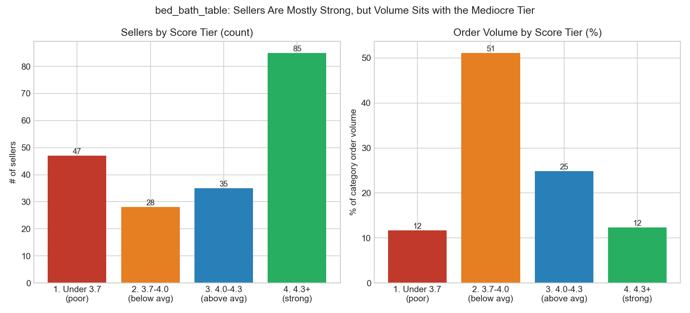

# Which product categories underperform on customer satisfaction, and why?

**Dataset:** [Olist Brazilian E-Commerce Public Dataset](https://www.kaggle.com/datasets/olistbr/brazilian-ecommerce) (Kaggle) — ~99K orders from a Brazilian e-commerce marketplace, 2016–2018.

## Business question

Olist is a marketplace: it connects third-party sellers to customers, and customer satisfaction (measured via a 1–5 review score per order) is the main signal marketplace operators have for where quality is breaking down. Not all product categories perform equally, and the reflex assumption at most companies is "bad reviews mean slow shipping." I wanted to test that assumption directly:

> **Which product categories have the lowest customer satisfaction, is slow delivery actually the cause, and — for the worst offender — what's the real, fixable driver?**

## Approach

All analysis is in [`sql/`](../sql/), numbered in the order I ran it, each file runnable standalone against `data/olist.db`.

1. **Data quality checks first** (`01`–`04`): confirmed 97% of orders reach `delivered` status (safe to filter to those for delivery-timing analysis), confirmed the two delivery-date fields have zero nulls once filtered, found and handled a silent data bug (610 products have `product_category_name = ''`, not `NULL` — would have formed a fake blank category if left uncaught), and confirmed 99.2% of orders touch only one product category (so attributing an order's review to "a category" is safe).
2. **Scoped to the top 15 categories by order volume** (`03`) to avoid long-tail categories where 5 orders and one bad review swing the average meaninglessly.
3. **Computed average review score per category** (`05`), de-duplicating the ~550 orders that had more than one review row (kept the most recent by `review_answer_timestamp`).
4. **Computed delivery lateness per category** (`06`): actual delivery date minus Olist's estimated delivery date, plus % of orders that arrived after the estimate.
5. **Correlated the two** (`07`) using a manually-computed Pearson coefficient (SQLite has no built-in `CORR()`).
6. **Drilled into the worst category** (`08`–`10`) at the seller level, to find out whether its low score is a category-wide problem or concentrated in specific sellers.

## Findings

**1. There's a real satisfaction gap between categories, but it's moderate, not extreme.** Average review score across the top 15 categories ranges from **3.97 (`bed_bath_table`, worst)** to **4.20 (`perfumery`, best)** — a ~0.23-star spread. `bed_bath_table`, `telephony`, and `furniture_decor` are the three lowest performers.

**2. Delivery lateness is a partial explanation, not the main one.** Every category's deliveries arrive early on average relative to Olist's estimate (Olist pads its delivery windows), and late-delivery rates cluster tightly in a 7–10% band across all 15 categories. The correlation between a category's late-delivery rate and its average review score is **r = -0.49** — a real, moderate relationship (more lateness does associate with lower scores), but it only accounts for about a quarter of the variance (r² ≈ 0.24) between categories. `bed_bath_table` isn't even the latest-delivering category. `electronics` and `health_beauty` in particular sit well above the trend line despite high late-delivery rates. **Something else is driving three-quarters of the gap.**

**3. For the worst category (`bed_bath_table`), the driver is volume concentration in mediocre sellers — not a few catastrophic sellers, and not a systemic category problem.** Breaking the category's ~9,500 orders down by seller:

| Seller score tier | # of sellers | Orders | % of category volume |
|---|---|---|---|
| Under 3.7 (poor) | 47 | 1,110 | 11.7% |
| 3.7–4.0 (below category avg) | 28 | 4,867 | **51.1%** |
| 4.0–4.3 (above category avg) | 35 | 2,364 | 24.8% |
| 4.3+ (strong) | 85 | 1,177 | 12.4% |

The largest group of sellers by *count* (85) actually scores well (4.3+) — but they're small, low-volume sellers, collectively handling only 12% of orders. The category average is being pulled down by a much smaller group: **28 sellers, each individually "not terrible, just mediocre" (3.7–4.0), who together carry 51% of all category volume.** The single largest seller in the category (15.1% of all `bed_bath_table` orders) scores 3.85 — below average — while the second-largest (11.2% of orders) scores 4.11, above average. It is not simply "bigger seller = worse seller"; it's that half the category's volume happens to sit with sellers who are mediocre rather than good.

## Recommendation

For a non-technical stakeholder (e.g. a marketplace operations lead):

> Don't launch a category-wide "fix bed_bath_table" logistics initiative — the data doesn't support that as the primary lever, since delivery timing looks about the same as every other category. Instead, **run a targeted seller-improvement program for the ~28 sellers who are consistently mediocre (not broken, just below-average) and who together account for over half of this category's order volume.** Even a modest quality/fulfillment improvement pushing these sellers from the 3.7–4.0 band into the 4.0+ band would move the category's overall satisfaction score more than any category-wide initiative, because of how much volume sits with this specific group. The top 7 sellers in this group alone represent roughly 3,350 of the category's ~9,500 orders — that's a short, prioritized list to start account-management outreach with, not an open-ended category audit.

## Limitations

- **Correlation, not causation, and a small sample.** The delivery-lateness correlation is based on 15 category-level data points — real signal, but not a statistically ironclad claim.
- **Seller IDs are anonymized hashes** in this public dataset, so "audit seller X" is illustrative of the *type* of action the data supports, not a literal to-do list a real company could act on with these exact IDs.
- **Review score doesn't capture *why*** a customer was unhappy — this dataset has free-text review comments that weren't analyzed here (a natural extension: text analysis of low-score reviews for the priority seller list, to confirm the mechanism e.g. product damage vs. wrong item vs. slow response).
- **The same seller-concentration lens wasn't run on `telephony` or `furniture_decor`** (the other two low-scoring categories) — this write-up scopes to the worst category to keep the analysis focused; the same method would extend directly to the others.
